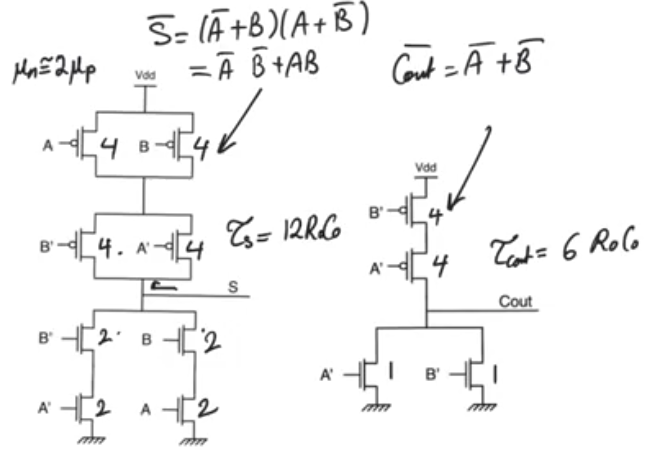
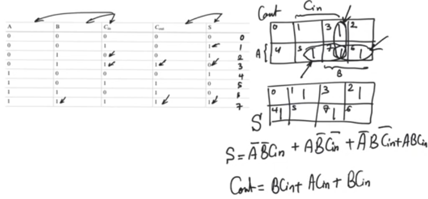
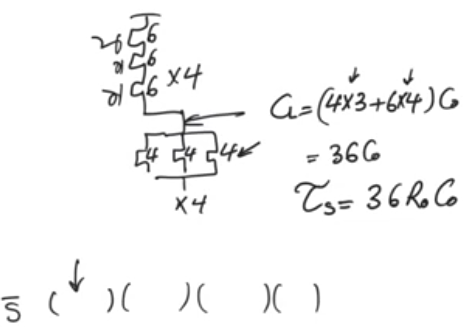
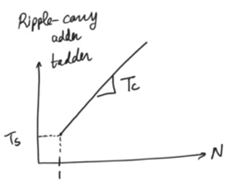

# Half adders and Full adders
source:

## Intro
- Building blocks for larger adders
- Half adders accepts two input bits, and produceses two output bits, called 2:2 compressor
- Full adders accepts three input bits, and produceses two output bits, called 3:2 compressor
- All other arithmatics are built using adders so if you can build fast adders, you can build fast arithmatic circuits in general
 

## Half adder
- Half adders are more important in multiplier than they are in N-bit adders
- sum gate is more complicated than the carry gate 
- The internsic time constant for the sum gate is double the time constant for the carry gate

## Full adder
- most of the building blocks use full adders rather than half adders
- In N-bit adders even though the sum gate itself is more complicated than the carry gate, it's the carry that matters the most, it's the carry that scales the delay of the adder the most.
- The internsic time constant for the sum gate is double the time constant for the carry gate

## N-bit adders
- For N-bit input we need N+1 bit output
- first it needs half adder, rest of the bits needs full adder
- we gonna assume there is a carry in coming from the outside, cause this N-bit adder can be used to build larger adders.
    - use full adder for the first bit

- For arithmatic circutis what we care about the most is speed and delay not area, not power dissipation  
- What we care about the most is how the delay behave as the number of bits increases 

- we assume there are registers at every input and output
    - assume all inputs are ready at time 0 
    - Tc is the propagation delay for the carry gate, and Ts is the propagation delay for the sum gate
    - get the critical path (the longest delay between any input register and any output register)

### Ripple carry adders

- For a 5-bit ripple carry adder S4 is ready the last 

- delay = (N-1)*Tc + Ts 
- Its delay is pretty good for small inputs but it starts to increase for larger inputs and it increases linearly 
- Even though Tsum is larger than Tcarry, Tcarry is more important cause Tcarry represents the slope of delay curve when drawn againts input bits
- So for a very large number of input bits which is the case in modern processers which uses wide buses the carry delay is gonna dominate

