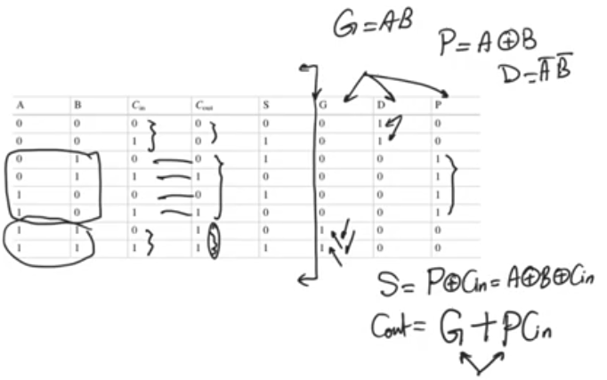
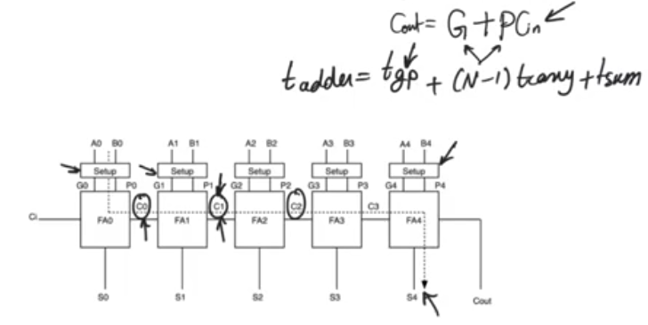

# Generate-propagate logic 
source [this](https://www.youtube.com/playlist?list=PLyWAP9QBe16qnuE-nw0RkUq0IwRkzqyhD) playlist on arithmetic circuits.

## Full adder generate propagate
- same full adder truth table 
- G D P are mutually execlusive bits, if you look them, you'll find that at any row one of these three can be one at a time 
- They represent the state of the carry out
- for the last two rows Cout = 1 when Cin = 0 and Cin = 1. 
    - Generate bit G = 1  
    - this means that for these two last rows, the full adder is generating the carry out
    - The full adder produces a carry out = 1 regardless of the carry in
    - so we say the full adder is generating and assert the generate bit and the two other bits are zero
- for the first two rows Cout = 0 when Cin = 0 and Cin = 1, 
    - Delete bit D = 1 
    - The full adder is deleting so we assert the D bit
- for the four intermediate rows, we see the value of carry out is exactly the same as carry in Cout = Cin
    - Propagate bit P = 1
    - The full adder is propagating the value of Cin to Cout
- The eight rows of the truth table are divided into three chunks
    - Chunk containing two rows  in which the carry out is being generated regardless of the value of carry in
    - Chunk containing two rows  in which the carry out is null regardless of the value of carry in
    - Chunk containing four rows  in which the carry out is the same as carry in

### What's intersting about this ? 
- G, D and P can be defined exclusively in terms of A and B inputs without the carry
- The inputs A and B in N-bit adder are ready at the start of the operation
- G, D and P can be calculated in terms of A and B
- therefore we can say that G, D and P are ready at the start of operation

### G, D and P from A, B
- G=1 when A and B = 1 so G = A and B
- P=1 when A = 1 and B = 0 so P = A XOR B
- D=1 when A and B = 0 so G = NOT A and NOT B

- the sum of the full adder equals the xoring of the three inputs (A, B, Cin)
    - S = A XOR B XOR Cin = P XOR Cin
- Carry out will be 1 when generating, or if the carry in = 1 when propagating
    - Cout = G OR (P AND Cin)
- if you expand these expression you'll have the same expressions for sum and carry out

## N-bit adder imporvement
- Inputs As and Bs are first gonna pass through a setup stage 
- The setup stage is gonna calculate the Gs and the Ps from the As and the Bs according to G=AB,P=AxorB 
- Then we calculate C0 from G, P and Cin, then we calculate C1
- C1 has to wait for C0 to be ready to be calculated and so on.
- we gonna need  Tgp + (N-1)*Tcarry + Tsum for the final output to be ready
- the delay is exactly the same as the ripple carry adder plus a small immaterial delay of the setup stage

### Manchester-carry chain
- Using dynamic gates
- When G=1 the bottom Nmos transistor is active, and the output is grounded, after the inverter C1 = 1, regardless of any other value
- When P=1 the transmission gate will be on allowing us to get Cout= Cin(BAR) inverted
- If neither P nor G are equal to 1, the output node is gonna reserve the precharge value of Vdd and Cout = 0 regardless of anything else, which is the delete case
- This is called the manchester-carry chain, it's gonna have a delay similar to the ripple carry adder but it can be used to do some intersting things.

