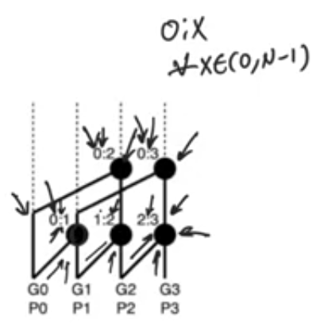
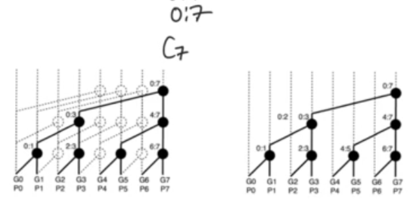
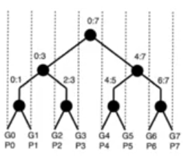
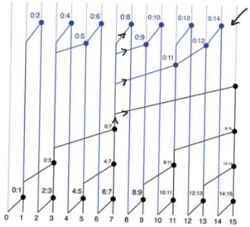

# parallel prefix adders
source [this](https://www.youtube.com/playlist?list=PLyWAP9QBe16qnuE-nw0RkUq0IwRkzqyhD) playlist on arithmetic circuits.

## Introduction
- [group generate and propagate](7-group-generate-propagate.md) and dot operator are useful because if used progressivly they can be used to design some of the fastest adders available
- These adders fall under a category called PPA parallel prefix adders
- gonna discuss two architecture the Kogge-Stone (KS) adder and Brent-Kunge (BK) adder
- The adder is done once it has calculated all the carry outs for all the positions because it needs all the carry outs inorder to calculate the sums
- The adder is able to calculate the carry out for a position once it has available all the group generate and group propagate for that range all the way up from point zero
- so if we have the group generate and propagate from zero we can calculate that means using only carry in we can calculate the carry out for the bit position

## Kogge-Stone adder
### 4 bit example
- every black circle is a dot operator, every row is a step or a row of dot operators that produces group generate and group propagate
- at the first row combine position 0,1 to produce P0:1, G0:1, and combine positions 1,2 to produce P1:2,G1,2, and so on
- All these operations in the row happen at the same time
- at the second row we combine position 0 with group 1:2 to produce P0:2,G0:2 and range 0:1 with 2:3 to produce P0:3, G0:3
- at this point we can say that the adder is done because it has produced 0:x for every x within the range of the adder from 0 to N-1
- so all the carry positions can be calculated and all the sum positions can be calculated

### Larger adders
- for larger adders to calculate positions 0:x for all N bits we add more layers
- so we need 2 layers for the 4 bit adder, 3 layers for 8 bit adder, 4 layers for 16 bit adder
- The order of the delay of the adder O(log2(N)) so it grows logarithmically with the number of bits
- This is the slowest growth in delay we can have in an adder, fastest class of adder we can have

 

### Disadvantage
- The number of units used, the number of dot operators
    - the number of dot operators grows really quicly with the number of bits where it grows linearly in a [ripple carry adder](1-2-adders.md)
- for a large number of bits routing starts to become really congisting, alot of wires running over other wires.
    - the place and route tool gonna have hard time finding a solution for an adder like this compared to an adder like riplle carry adder

## Brent-Kunge adder
### Modified KS
- In an 8-bit KS adder, assume we only need carry position 7
- so we are gonna trim every part of the circuit that didn't contribute to the calculation of the ranges 0:7
- we have a much smaller circuit without all the congistion in routing in KS adder, but it's not a full adder, it's not producing something meaningfull

- it's  only 2x2 bit combination till we reach position 7, you combine the ranges in twos till we reach the entire range, that's why it works in a logarithmic fashion

### Brent-Kunge adder
- This modified version doesn't only produce C7, it's also produces C1 and C3, which means it's only missing C2, C4, C5, C6 inorder to be a correct 8-bit adder
- Finding the missing ranges can be done using the exisiting ones
    - combine range 0:1 with bit position 2 to produce C2
    - combine range 0:3 with bit position 4 to produce C4
    - combine range 0:3 with range 4:5 to produce C5
    - combine range 0:5 with bit position 7 produce C6
- This adder now is actually an 8 bit adder, it's producing all the carryouts for all the bit positions

### Compare to KS adder
- advantage in routing, routing congistion is gonna be much smaller in BK adder
### Disadvantage
- number of layers (stages) is more than KS adder, but the growth is still gonna be O(log2(N))
- fan-out
    - In KS adder every dot operator is gonna feed at most two outputs so the fan-out of each dot operator is gonna be at most two other dot operators
    - In the BK adder some of the dot operators are feeding alot more than two, up to 4 in the 16-bit version
    - this means that its effort is much higher, which gonna affect delay even further

