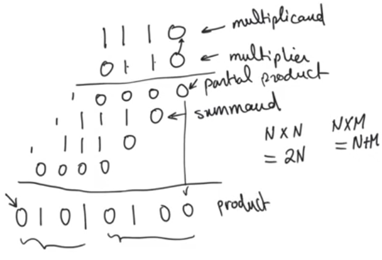

# Multipliers
source [this](https://www.youtube.com/playlist?list=PLyWAP9QBe16qnuE-nw0RkUq0IwRkzqyhD) playlist on arithmetic circuits.

## Binary long multiplicaiton
- Long multiplication in binary is done the same way as it's done in decimal by the calculation of partial products and the addition of the summands that result from this operation to produce a final product
- understanding how arithmatic goes helps build the hardware
- each of the bits is called a partial product
- each of the rows is called a summand
- the product length is the summation of each of the operands length
    - that's why when we do [fixed point analysis](../design-flow/6-fixed-point.md) we focus on multipliers because they have very bad dynamic range
- Implementation is divided into two things
    - Calculation of the partial products
    - Combination of the partial products into the final product
- In binary the summation of the summands has the majority of the complixity of the multiplier
- Calulating partial product is extremly simple cause each partial product is an AND gate
    - the summands are one of two things, either zero or copies of the multiplicand depending on the current bit of the multiplier
- Multiplication is really just about adding shifted versions of the multiplicand each of which is called a summand
- Doing fast multiplication is contingent on doing fast addtion
- Eventhough the critical path of most DSP circuits lies in mutlipliers, optimizing the solution is more about focusing on adders rather than multipliers

### Mutlipliers
- Hardware multipliers are big interms of area and their delay is much larger than that of adders and their power is very high
    - They have large capacitance because of the large area and they are also slow
    - They have really bad power delay prodcut
- so if we can avoid the use of multipliers that would be a good thing
- creating a multiplier is contingent on every operand being a variable, in that case we need an actual full multiplier
- if one of the operands is a constant, this isn't considered a full multiplier
    - Z = 4y : shift by two bit positions
    - Z = 32y : shift by 5 bit positions 
    - Z = 5x = 4x + x : shifter by 2 bits and an adder that adds another shifted version of x to Z
    - Z = 31y = 32y-y
- A multiplier is just a bunch of shifts and adds, except that in the case of the full multiplier every single shift has to be considered because we don't know what the multiplier operand is in the current cycle, and what it'll be in the next cycle

## Array multipliers
- The length of the summand is determined by the order of the multiplicand and the number of summands is determined by the multiplier operand
    -  N * M multliplier
    -  M summands each of them is N bits long
- parallelogram of fulladders and halfadders that represent the summantion of the products

### Array 4x4 multiplier
- At every bit position we gonna use the minimum number of units possible.
- if at any point we can use a half adder we will use it.
- this implementation called the array or parallel multiplier
- gives the largest area, and also the highest throughput that you can get out of the mutliplier
- Consists of N*(M-1) units
    - M half adders
    - N*(M-1) - M full adders
    - we have to make this distinction because the area (complexity) of the half adder is alot less than the full adder
#### Critical path
- critical path starts at Z01 or Z10 and ends at M6
- there are mutliple paths between those two points 
    - the path the goes through the half adders to the M6 is not the critical path
    - because all the delays of the half adders are much smaller than the full adders
    - and there are full adders in parallel that provides a longer path.
- the dotted line showes the critical path,
- One of the biggest issues with array multipliers
    - we have two possible paths that are critical path
    - Array mutlipliers with large number of inputs will have multiple possible critical path
    - This is good in terms of power dissipation because this means everyone is finishing at the same time, which means nobody is spending more power than they need to
    - The problem with this is that it doesn't give us any room for improvement because logical effort of all the paths are equal so using sizing to try to reduce the delay of the multipliers not going to work, you'll just have to increase the size of everything to endup with the same delay and logical effort as you started with.

#### Critical path equation
- The carry of the first half adder TcHA
- Sum delays of full adder for each vertical step M * (TsFA)
- The carry moves N-1 horitontally because we end up at the last position and then sum delay (N-1) * (TcFA)
- Tmult = TcHA + M * TsFA + (N-1) TcFA
- The delay of the mutliplier is more than double the delay of an adder of the same size