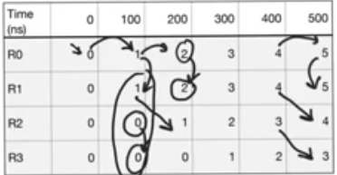

# process, transactions and events
source [this](https://www.youtube.com/playlist?list=PLyWAP9QBe16p2HXVcyEgGAFicXJI797jK) playlist on VHDL design.

## Process
   - Process allows executing sequence of events so you can have memory elements
   - Statements within processes execute in sequence.
   - Their main use is to declare registers and latches and memories
   - When the simulation starts, any process will execute at least once
   - There are different ways to control how often a process is executed like sensitivity list and wait statement

### Sensitivity list
   - A sensitivity list is a list of signals that lie in the parenthesis after the process statement, it’s a list of signals that sensitize the process, cause the process to execute whenever they change, so a process will execute once after simulation starts, and not gonna execute again until a change happens on a signal of the sensitivity list
   - In the example, R2 doesn’t take the current value of R1, it takes the previous value, because when R0 is assigned to R1 a transaction happened not an event

```
process_label: process(R0) // R0 is in the sensitivity list
begin
    R1 <= R0;
    R2 <= R1;
    R3 <= R2;
end process; // change happens here
```


## Transactions and events
   - Event is an actual change in the value of the signal
   - When the value of a signal changes, in a register, of a wire that’s an event
   - Transaction is just a scheduling of an event, an intend to change the value of a signal
   - Whenever you make a signal assignment in a process that causes a transaction not an event, so the value of the signal doesn’t change.
   - A transaction turn into an event at the end of the process -for now-
   - Updating transactions to events takes zero times, it takes a nominal delay which is delay that takes place within the simulator, it doesn’t take any real delay, it’s an artifact of the simulator but it’s necessary because without having a distinction between transactions and events you can't have registers and latches
## fully populated sensitivity list
   - If the sensitivity list of the process is fully populated, having (R0, R1, R2), when R0 is changed, the process is called -with 0 delay- and an event happens on R1, so the process is called again immediately -with 0 delay- so the value of R1 will update with the value of R0 which hasn’t changed, and the value of R2 will update with the new value of R1, and a new event of R2 happens and the process is called again and this all happens with 0 delay 
   - So when we have a fully populated sensitivity list, the code within the process became compinational 
   - A process with a deficient sensitivity list will be used to declare registers, A process with a complete sensitivity list will be used to declare complicated combinational blocks like state machines.

