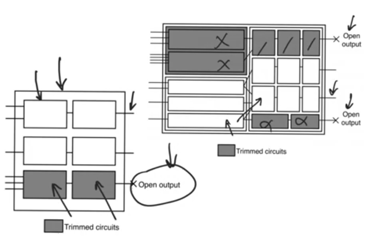

# special port mapping
source [this](https://www.youtube.com/playlist?list=PLyWAP9QBe16p2HXVcyEgGAFicXJI797jK) playlist on VHDL design.

## Port mapping
   - All ports have to be connected, even inputs that are don't care, even outputs that are not used have to be connecte, maybe to an open circuit. 
   - input_a => (others => ‘0’), connect input a to a (bus, register, locations) carrying all zeros, it’s better to use this cause it makes code scalable
   - others syntax is useful when you want to concatenate a string of ones or zeros to complete a certain port or a certain register
   - Input_b => external_input(8 downto 0) & (others => ‘1’),
   - output_a => open, connects the output to an open circuit
   - Input_c => conv_std_logic_vector(9,16), this function converts the integer number 9 to a standard logic vector of width 16

## unconnected ports
- When inputs are left open or connected to constant value
   - It allows the synthesizer to trim a lot of circuitry
   - It trims or remove every logic in the component that is connected to an open circuit or unconnected output
   - It’s a good practice to do so cause it allows it to minimize the resource usage
   - This is the case with constant inputs, if for example an adder or multiplier have two constant inputs, the synthesizer will remove the hardware, and replace it with a constant value which is the result of the process.



## For generate
   - for  generate syntax to generate a bunch of instances
   - It’s not a loop, it’s a way of indicating that we are generating a very large number of the same component

```
gen_reg: for generation_index int 0 to 15 generate

DFFX : DFF
port map(
D => D(generation_index),
Q => Q(generation_index),
clk => clk);

end generate;
```

## Binding architecture to a component
   - Binding a certain architecture to a component while instantiating
   - Any instantiation will assume the last entity’s architecture unless otherwise stated
   - To choose other architecture, when declaring an instance write the architecture name between () after the entity’s name

```
Add1: entity word.sixteen_bit_add(behavioral1)
    port map(input_a => external_inputa,
        input_b => external_inputb,
        add_output => internal_inputa);
Add2: entity word.sixteen_bit_add(behavioral2)
    port map(input_a => external_inputc,
        input_b => external_inputd,
        add_output => internal_inputb);
```
